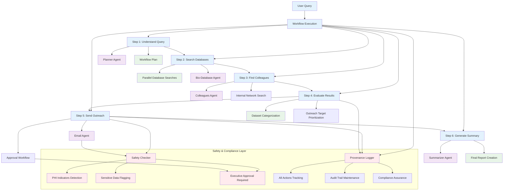
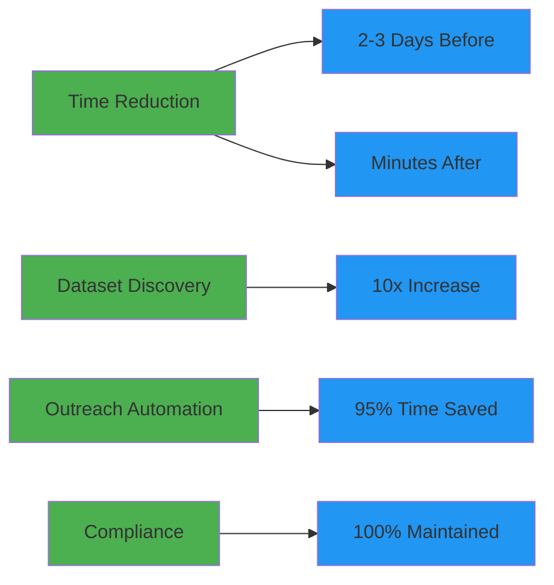
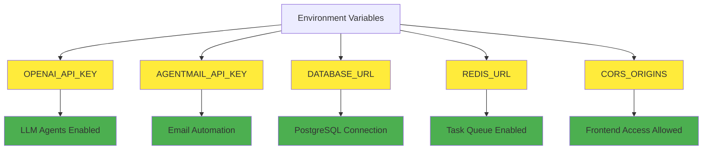
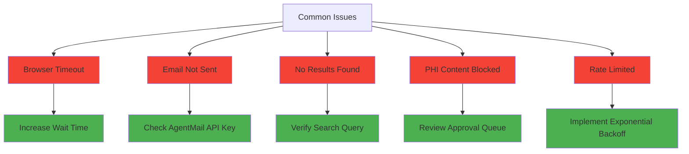

# Biodata Assistant - System Architecture

## Overview
Biodata Assistant is a multi-agent system designed to automate cancer research data discovery and outreach workflows. It reduces the time researchers spend finding biological datasets from 2-3 days to minutes by automating database searches, colleague discovery, and email outreach.

## Core Problem Solved
Cancer researchers (bioinformaticians, data scientists, ML engineers) need to:
1. Search multiple biological databases (GEO, PRIDE, Ensembl)
2. Find internal colleagues who might have relevant data
3. Write and send outreach emails to request data access
4. Track responses and manage the workflow

## System Components

### 1. Backend Infrastructure (FastAPI)
- Location: `/backend`
- Technology: Python 3.10+, FastAPI, SQLAlchemy, Pydantic
- Purpose: RESTful API server providing endpoints for search, dataset management, and outreach

### 2. Multi-Agent System (Pydantic AI)
- Framework: Pydantic AI with typed agents
- Agents: 5 specialized agents for different workflow steps
- Orchestration: Central orchestrator coordinates agent interactions

### 3. External Integrations
- Browser-Use: Web scraping for NCBI/GEO and LinkedIn
- AgentMail: Email automation and webhook handling
- Database: SQLite (dev) / PostgreSQL (prod)

## Knowledge Graph - System Relationships

### Backend Infrastructure Relationships

```mermaid
flowchart TD
    %% API Layer
    FastAPI[FastAPI Server] --> APIRouter[API Router]
    APIRouter --> SearchEndpoint[Search Endpoint]
    APIRouter --> DatasetEndpoint[Dataset Endpoint]
    APIRouter --> OutreachEndpoint[Outreach Endpoint]
    APIRouter --> TaskEndpoint[Task Endpoint]
    APIRouter --> WebhookEndpoint[Webhook Endpoint]

    %% Endpoint Functions
    SearchEndpoint --> AgentOrchestrator[Agent Orchestrator]
    DatasetEndpoint --> DatasetCRUD[Dataset CRUD]
    OutreachEndpoint --> OutreachRequests[Outreach Requests]
    TaskEndpoint --> BackgroundTasks[Background Tasks]
    WebhookEndpoint --> EmailReplies[Email Replies]

    %% Database Layer
    SQLAlchemy[SQLAlchemy ORM] --> DatabaseModels[Database Models]
    DatabaseModels --> UserModel[User Model]
    DatabaseModels --> DatasetModel[Dataset Model]
    DatabaseModels --> OutreachRequestModel[Outreach Request Model]
    DatabaseModels --> ProvenanceModel[Provenance Model]
    DatabaseModels --> TaskModel[Task Model]

    %% Model Purposes
    UserModel --> ResearcherProfile[Researcher Profile]
    DatasetModel --> BiologicalDatasets[Biological Datasets]
    OutreachRequestModel --> EmailOutreach[Email Outreach]
    ProvenanceModel --> AuditTrail[Audit Trail]
    TaskModel --> AsyncOperations[Async Operations]

    %% Configuration Layer
    Config[Configuration] --> EnvironmentVariables[Environment Variables]
    Config --> APIKeys[API Keys]
    Config --> DatabaseURL[Database URL]
    Config --> CORSOrigins[CORS Origins]

    %% Styling
    classDef apiLayer fill:#e1f5fe
    classDef dbLayer fill:#f3e5f5
    classDef configLayer fill:#e8f5e8

    class FastAPI,APIRouter,SearchEndpoint,DatasetEndpoint,OutreachEndpoint,TaskEndpoint,WebhookEndpoint apiLayer
    class SQLAlchemy,DatabaseModels,UserModel,DatasetModel,OutreachRequestModel,ProvenanceModel,TaskModel dbLayer
    class Config,EnvironmentVariables,APIKeys,DatabaseURL,CORSOrigins configLayer
```


### Agent System Relationships

```mermaid
flowchart TD
    %% Agent Hierarchy
    AgentOrchestrator[Agent Orchestrator] --> PlannerAgent[Planner Agent]
    AgentOrchestrator --> BioDatabaseAgent[Bio-Database Agent]
    AgentOrchestrator --> ColleaguesAgent[Colleagues Agent]
    AgentOrchestrator --> EmailAgent[Email Agent]
    AgentOrchestrator --> SummarizerAgent[Summarizer Agent]

    %% Planner Agent Flow
    PlannerAgent --> ResearchQuery[Research Query]
    PlannerAgent --> DataModalities[Data Modalities]
    PlannerAgent --> WorkflowPlan[Workflow Plan]
    PlannerAgent --> CancerKeywords[Cancer Keywords]
    ResearchQuery --> P53Mutations[P53 Mutations]
    ResearchQuery --> LungAdenocarcinoma[Lung Adenocarcinoma]
    ResearchQuery --> TNBC[Triple-Negative Breast Cancer]

    %% Bio-Database Agent Flow
    BioDatabaseAgent --> BrowserUse1[Browser-Use Framework]
    BioDatabaseAgent --> NCBIGEO[NCBI/GEO Database]
    BioDatabaseAgent --> PRIDE[PRIDE Database]
    BioDatabaseAgent --> Ensembl[Ensembl Database]
    BioDatabaseAgent --> DatasetMetadata[Dataset Metadata]
    BioDatabaseAgent --> DatasetRelevance[Dataset Relevance]
    NCBIGEO --> GeneExpressionData[Gene Expression Data]
    PRIDE --> ProteomicsData[Proteomics Data]
    Ensembl --> GenomicsData[Genomics Data]

    %% Colleagues Agent Flow
    ColleaguesAgent --> BrowserUse2[Browser-Use Framework]
    ColleaguesAgent --> LinkedIn[LinkedIn Search]
    ColleaguesAgent --> InternalExperts[Internal Experts]
    ColleaguesAgent --> EmailSuggestions[Email Suggestions]
    InternalExperts --> Bioinformatics[Bioinformatics Experts]
    InternalExperts --> Genomics[Genomics Experts]
    InternalExperts --> Oncology[Oncology Experts]

    %% Email Agent Flow
    EmailAgent --> AgentMailSDK[AgentMail SDK]
    EmailAgent --> ProfessionalEmails[Professional Emails]
    EmailAgent --> OutreachRequests[Outreach Requests]
    EmailAgent --> ApprovalRequirements[Approval Requirements]
    EmailAgent --> PHIContent[PHI Content Detection]
    OutreachRequests --> RestrictedDatasets[Restricted Datasets]
    PHIContent --> HumanApproval[Human Approval Required]

    %% Summarizer Agent Flow
    SummarizerAgent --> SearchResults[Search Results]
    SummarizerAgent --> DatasetQuality[Dataset Quality Analysis]
    SummarizerAgent --> ExecutiveSummary[Executive Summary]
    SummarizerAgent --> ExportData[Export Data]
    ExecutiveSummary --> Recommendations[Recommendations]
    ExportData --> CSV[CSV Format]
    ExportData --> Excel[Excel Format]

    %% Styling
    classDef orchestrator fill:#ff9999
    classDef agent fill:#99ccff
    classDef data fill:#99ff99
    classDef service fill:#ffcc99
    classDef output fill:#cc99ff

    class AgentOrchestrator orchestrator
    class PlannerAgent,BioDatabaseAgent,ColleaguesAgent,EmailAgent,SummarizerAgent agent
    class ResearchQuery,DataModalities,WorkflowPlan,DatasetMetadata,SearchResults,ExecutiveSummary data
    class BrowserUse1,BrowserUse2,AgentMailSDK,LinkedIn,NCBIGEO,PRIDE,Ensembl service
    class CSV,Excel,Recommendations,ExportData output
```


### External Integration Relationships

```mermaid
flowchart TD
    %% Browser-Use Integration
    subgraph "Browser-Use Integration"
        GEOScraper[GEO Scraper] --> BrowserUseAgent1[Browser-Use Agent]
        GEOScraper --> NCBIWebsite[NCBI Website Navigation]
        GEOScraper --> DatasetAccession[Dataset Accession Extract]
        GEOScraper --> SampleSize[Sample Size Extract]
        GEOScraper --> ContactInfo[Contact Info Extract]

        LinkedInScraper[LinkedIn Scraper] --> BrowserUseAgent2[Browser-Use Agent]
        LinkedInScraper --> CompanyEmployees[Company Employees Search]
        LinkedInScraper --> JobTitles[Job Titles Extract]
        LinkedInScraper --> RelevanceScore[Relevance Score Calculation]
    end

    %% AgentMail Integration
    subgraph "AgentMail Integration"
        AgentMailClient[AgentMail Client] --> AsyncAgentMail[Async AgentMail Wrapper]
        AgentMailClient --> EmailMessages[Email Message Sending]
        AgentMailClient --> DeliveryStatus[Delivery Status Handling]
        AgentMailClient --> EmailReplies[Email Reply Processing]

        WebhookReceiver[Webhook Receiver] --> Signatures[Signature Verification]
        WebhookReceiver --> OutreachStatus[Outreach Status Updates]
        WebhookReceiver --> Provenance[Provenance Logging]
    end

    %% Database Relationships
    subgraph "Database Relationships"
        Dataset[Dataset Entity] --> AccessTypes[Access Types]
        AccessTypes --> Public[Public Access]
        AccessTypes --> Request[Request Required]
        AccessTypes --> Restricted[Restricted Access]

        Dataset --> DataModalities[Data Modalities]
        DataModalities --> Transcriptomics[Transcriptomics Data]
        DataModalities --> Proteomics[Proteomics Data]
        DataModalities --> Genomics[Genomics Data]

        OutreachRequest[Outreach Request Entity] --> RequestStatus[Request Status]
        RequestStatus --> Pending[Pending Status]
        RequestStatus --> Sent[Sent Status]
        RequestStatus --> Replied[Replied Status]
    end

    %% Cross-Integration Connections
    EmailMessages --> OutreachRequest
    EmailReplies --> RequestStatus
    DatasetAccession --> Dataset
    ContactInfo --> EmailMessages

    %% Styling
    classDef scraper fill:#ffeb3b
    classDef email fill:#4caf50
    classDef database fill:#2196f3
    classDef status fill:#ff9800

    class GEOScraper,LinkedInScraper,BrowserUseAgent1,BrowserUseAgent2 scraper
    class AgentMailClient,WebhookReceiver,EmailMessages,EmailReplies email
    class Dataset,OutreachRequest,AccessTypes,DataModalities database
    class Pending,Sent,Replied,Public,Request,Restricted status
```


### Workflow Relationships


## Directory Structure
```
biodata-assistant/
├── backend/
│   ├── app/
│   │   ├── api/v1/          # API endpoints
│   │   ├── core/
│   │   │   ├── agents/       # Pydantic AI agents
│   │   │   ├── scrapers/     # Browser-Use implementations
│   │   │   ├── integrations/ # AgentMail client
│   │   │   └── utils/        # Utilities (provenance, etc.)
│   │   ├── models/           # Database models & schemas
│   │   └── utils/            # Email templates, exceptions
│   ├── tests/                # Unit and integration tests
│   ├── requirements.txt      # Python dependencies
│   └── docker-compose.yml    # Container orchestration
├── phase_*.md                # Implementation plans
└── *-doc.md                  # Documentation files
```

## Data Flow

### Search Request Flow
```
1. User -> submits -> SearchQuery
2. SearchEndpoint -> creates -> Task
3. Task -> triggers -> AgentOrchestrator
4. AgentOrchestrator -> executes -> PlannerAgent
5. PlannerAgent -> creates -> WorkflowPlan
6. AgentOrchestrator -> parallelizes -> SearchAgents
7. BioDatabaseAgent -> scrapes -> NCBIGEO
8. ColleaguesAgent -> scrapes -> LinkedIn
9. Results -> stored -> Database
10. EmailAgent -> sends -> OutreachEmails
11. SummarizerAgent -> generates -> Report
12. Report -> returned -> User
```

### Email Outreach Flow
```
1. Dataset -> requires -> AccessRequest
2. EmailAgent -> composes -> OutreachEmail
3. SafetyChecker -> validates -> EmailContent
4. ApprovalRequired? -> queues -> HumanReview
5. Approved -> sends -> AgentMail
6. AgentMail -> delivers -> Email
7. Recipient -> replies -> Email
8. Webhook -> receives -> Reply
9. WebhookHandler -> updates -> OutreachStatus
10. User -> notified -> ReplyReceived
```

## Key Technologies

### Core Stack
- Backend: FastAPI (Python 3.10+)
- Database: SQLAlchemy + SQLite/PostgreSQL
- Validation: Pydantic
- Agents: Pydantic AI
- Scraping: Browser-Use
- Email: AgentMail SDK
- Container: Docker + Docker Compose

### Agent Technologies
- LLM Provider: OpenAI GPT-4o / Anthropic Claude
- Agent Framework: Pydantic AI with typed tools
- Browser Automation: Browser-Use with Puppeteer
- Email Service: AgentMail API

## Security & Compliance

### PHI Protection
```
PHIDetector -> scans -> DatasetTitles
PHIDetector -> scans -> EmailContent
PHIDetector -> triggers -> ApprovalWorkflow
ApprovalWorkflow -> requires -> HumanReview
ApprovalWorkflow -> logs -> DecisionProvenance
```

### Audit Trail
```
Every action -> logged -> ProvenanceTable
ProvenanceTable -> contains -> Actor
ProvenanceTable -> contains -> Action
ProvenanceTable -> contains -> Timestamp
ProvenanceTable -> contains -> ResourceID
ProvenanceTable -> enables -> Compliance
```

## Performance Optimizations

### Caching
```
ResultCache -> stores -> SearchResults
ResultCache -> reduces -> RedundantSearches
ResultCache -> expires -> After30Minutes
```

### Parallel Processing
```
ParallelExecutor -> limits -> ConcurrentTasks
ParallelExecutor -> manages -> RateLimiting
ParallelExecutor -> prevents -> APIOverload
```

## Testing Strategy

### Test Coverage
```
UnitTests -> cover -> Agents
UnitTests -> cover -> Scrapers
IntegrationTests -> cover -> Workflow
IntegrationTests -> cover -> EmailFlow
E2ETests -> cover -> UserJourney
E2ETests -> validate -> TimeReduction
```

## Deployment Configuration

### Docker Services
```
DockerCompose -> orchestrates -> Backend
DockerCompose -> orchestrates -> Database
DockerCompose -> orchestrates -> Redis
Backend -> depends -> Database
Backend -> depends -> Redis
Frontend -> connects -> BackendAPI
```

## Success Metrics

### Key Performance Indicators


## API Endpoints Summary

### Core Endpoints
- `POST /api/v1/search` - Initiate dataset search
- `GET /api/v1/search/{task_id}` - Check search status
- `GET /api/v1/datasets` - List discovered datasets
- `POST /api/v1/outreach` - Send outreach emails
- `POST /api/v1/webhooks/agentmail` - Receive email replies
- `GET /api/v1/tasks/{id}` - Monitor async tasks

## Environment Variables

### Required Configuration


## Design Updates

### Manual LinkedIn Login Workflow (Human-in-the-Loop)
- The system no longer attempts agentic credential entry for LinkedIn.
- Flow:
  1. The colleagues agent opens the LinkedIn login page in a persistent browser session (`start_linkedin_login_session()`).
  2. The user logs in manually while keeping the browser open.
  3. On confirmation in the TUI, the colleagues agent reuses the same session to navigate to the employees page and extract contacts (`search_linkedin_direct(..., use_existing_session=True)`), with automatic fallback to public search if session reuse fails.
- Persistence:
  - The LinkedIn scraper uses a fixed `user_data_dir` (`./temp-profile-linkedin`) so cookies persist across steps and instances.
  - The Browser-Use profile enables `keep_alive` to avoid premature browser termination during the login phase.
- Safety & compliance:
  - Credentials are never typed by the agent.
  - The user retains full control of authentication.
  - Provenance is logged for “manual login started” and subsequent LinkedIn actions.

### Structured Outputs and Typed Results
- Browser-Use agents are configured (where applicable) with `output_model_schema` and results are consumed via `result.structured_output`.
- GEO:
  - `GEOScraper` uses `GEODatasets` (wrapper) for structured extraction and normalizes to downstream fields (accession, title, organism, modalities, sample_size, etc.) with robust fallbacks.
- LinkedIn (agent helper paths):
  - `Contacts` schema for structured contact lists when Browser-Use agent utilities are used.
  - Deterministic “direct” paths return normalized JSON from Python logic (no free-form parsing).

### Demo Alignment
- The interactive TUI (`backend/demo.py`) now:
  - Offers a manual LinkedIn login step that opens a persistent login page.
  - Waits for the user to log in, then reuses the session for company employee discovery.
  - Falls back to public LinkedIn search automatically if a logged-in session cannot be reused.
- This ensures consistent UX and avoids anti-bot/credential risks while preserving end-to-end automation for non-sensitive steps.

### Outreach Behavior
- Login is only required for LinkedIn actions that need authenticated context.
- Outreach sending remains human-gated with explicit TUI confirmation and PHI gate.

## Troubleshooting Guide

### Common Issues


## Contact & Support
This system was developed for the CodeRabbit hackathon to solve real pain points in cancer research data discovery. The architecture is designed to be extensible, compliant, and performant while maintaining a clear separation of concerns.

---
