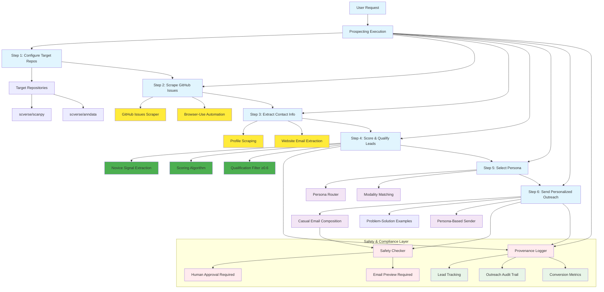
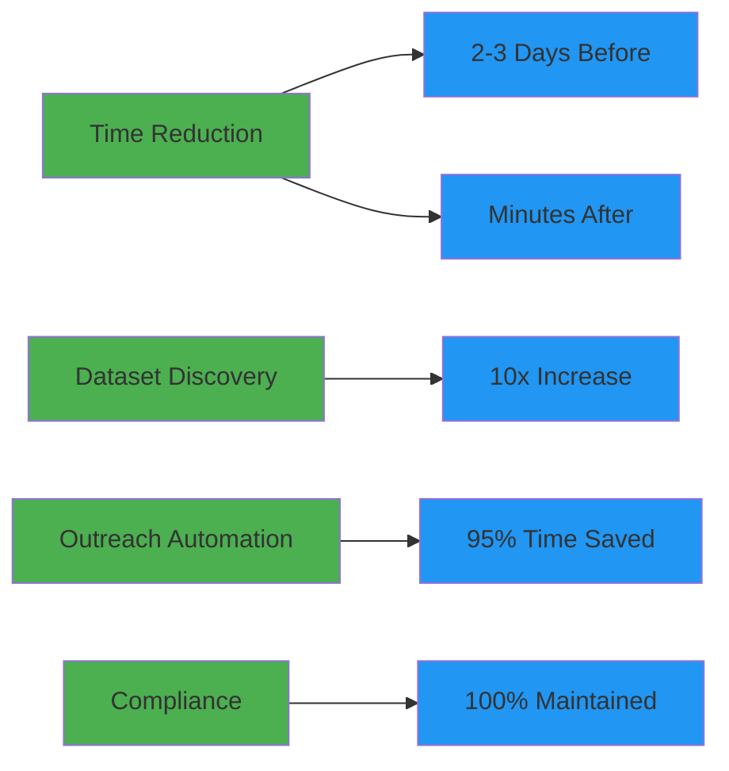
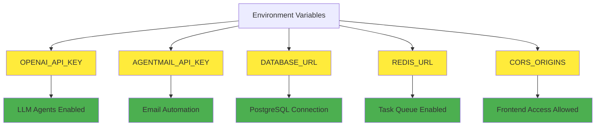
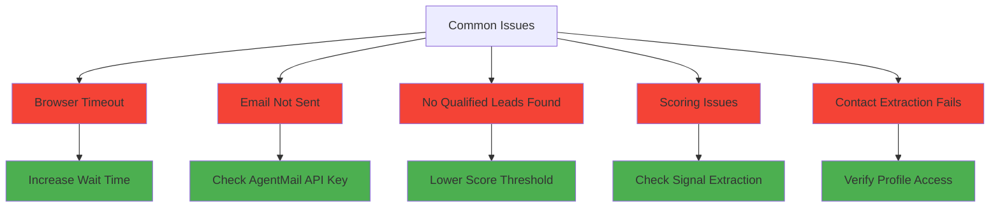

# Omics-OS Lead Generation System - Architecture

## Overview
Omics-OS Lead Generation System is a multi-agent system designed to automate GitHub prospecting and user acquisition for the omics-os no-code bioinformatics platform. It identifies struggling bioinformatics users in open-source repositories and converts them into omics-os prospects through intelligent scoring and persona-based casual outreach.

## Core Problem Solved
Omics-os marketing team needs to:
1. Identify potential users struggling with bioinformatics tools (ScanPy, AnnData, MuData, BioPython)
2. Extract contact information from GitHub users showing novice characteristics
3. Send personalized, empathetic outreach emails from appropriate domain experts
4. Track lead conversion and manage the prospect pipeline

## System Components

### 1. Backend Infrastructure (FastAPI)
- Location: `/backend`
- Technology: Python 3.10+, FastAPI, SQLAlchemy, Pydantic
- Purpose: RESTful API server providing endpoints for lead management, GitHub prospecting, and outreach

### 2. Multi-Agent System (Pydantic AI)
- Framework: Pydantic AI with typed agents
- Agents: GitHub leads agent, email agent with persona routing, scoring utilities
- Orchestration: GitHub prospecting workflow coordinates scraping, scoring, and outreach

### 3. External Integrations
- Browser-Use: Web scraping for GitHub issues and profile contact extraction
- AgentMail: Multi-persona email automation and webhook handling
- Database: SQLite (dev) / PostgreSQL (prod) with Lead tracking

## Knowledge Graph - System Relationships

### Backend Infrastructure Relationships

```mermaid
flowchart TD
    %% API Layer
    FastAPI[FastAPI Server] --> APIRouter[API Router]
    APIRouter --> SearchEndpoint[Search Endpoint]
    APIRouter --> DatasetEndpoint[Dataset Endpoint]
    APIRouter --> OutreachEndpoint[Outreach Endpoint]
    APIRouter --> TaskEndpoint[Task Endpoint]
    APIRouter --> WebhookEndpoint[Webhook Endpoint]

    %% Endpoint Functions
    SearchEndpoint --> AgentOrchestrator[Agent Orchestrator]
    DatasetEndpoint --> DatasetCRUD[Dataset CRUD]
    OutreachEndpoint --> OutreachRequests[Outreach Requests]
    TaskEndpoint --> BackgroundTasks[Background Tasks]
    WebhookEndpoint --> EmailReplies[Email Replies]

    %% Database Layer
    SQLAlchemy[SQLAlchemy ORM] --> DatabaseModels[Database Models]
    DatabaseModels --> UserModel[User Model]
    DatabaseModels --> DatasetModel[Dataset Model]
    DatabaseModels --> OutreachRequestModel[Outreach Request Model]
    DatabaseModels --> ProvenanceModel[Provenance Model]
    DatabaseModels --> TaskModel[Task Model]

    %% Model Purposes
    UserModel --> ResearcherProfile[Researcher Profile]
    DatasetModel --> BiologicalDatasets[Biological Datasets]
    OutreachRequestModel --> EmailOutreach[Email Outreach]
    ProvenanceModel --> AuditTrail[Audit Trail]
    TaskModel --> AsyncOperations[Async Operations]

    %% Configuration Layer
    Config[Configuration] --> EnvironmentVariables[Environment Variables]
    Config --> APIKeys[API Keys]
    Config --> DatabaseURL[Database URL]
    Config --> CORSOrigins[CORS Origins]

    %% Styling
    classDef apiLayer fill:#e1f5fe
    classDef dbLayer fill:#f3e5f5
    classDef configLayer fill:#e8f5e8

    class FastAPI,APIRouter,SearchEndpoint,DatasetEndpoint,OutreachEndpoint,TaskEndpoint,WebhookEndpoint apiLayer
    class SQLAlchemy,DatabaseModels,UserModel,DatasetModel,OutreachRequestModel,ProvenanceModel,TaskModel dbLayer
    class Config,EnvironmentVariables,APIKeys,DatabaseURL,CORSOrigins configLayer
```


### GitHub Lead Generation System Relationships
```mermaid
flowchart TD
    %% Core Lead Generation Flow
    GitHubProspecting[GitHub Prospecting Agent] --> IssuesScraper[GitHub Issues Scraper]
    GitHubProspecting --> ScoringEngine[Novice Scoring Engine]
    GitHubProspecting --> PersonaRouter[Persona Router]
    GitHubProspecting --> EmailAgent[Email Agent]

    %% Issues Scraping Flow
    IssuesScraper --> BrowserUseAgent[Browser-Use Agent]
    IssuesScraper --> ScanpyRepo[scverse/scanpy Repository]
    IssuesScraper --> AnndataRepo[scverse/anndata Repository]
    IssuesScraper --> IssueExtraction[Issue Data Extraction]
    IssuesScraper --> ProfileScraping[Profile Contact Extraction]
    
    ScanpyRepo --> IssueMetadata[Issue Metadata]
    AnndataRepo --> IssueMetadata[Issue Metadata]
    IssueMetadata --> IssueTitle[Issue Title]
    IssueMetadata --> IssueLabels[Issue Labels]
    IssueMetadata --> AuthorProfile[Author Profile]
    
    ProfileScraping --> GitHubProfile[GitHub Profile Data]
    ProfileScraping --> WebsiteExtraction[Personal Website Email Extraction]
    GitHubProfile --> ContactInfo[Contact Information]
    WebsiteExtraction --> ContactInfo[Contact Information]

    %% Scoring and Qualification Flow
    ScoringEngine --> SignalExtraction[Signal Extraction]
    ScoringEngine --> NoviceCalculation[Novice Score Calculation]
    ScoringEngine --> LeadQualification[Lead Qualification]
    
    SignalExtraction --> AccountAge[Account Age Analysis]
    SignalExtraction --> KeywordMatching[Novice Keyword Matching]
    SignalExtraction --> ActivityMetrics[GitHub Activity Metrics]
    SignalExtraction --> IssuePatterns[Issue Pattern Analysis]
    
    NoviceCalculation --> ScoreThreshold[Score Threshold ≥0.6]
    LeadQualification --> QualifiedLeads[Qualified Leads Pool]

    %% Persona and Outreach Flow
    PersonaRouter --> TranscriptaQuillborne[Transcripta Quillborne]
    PersonaRouter --> ProteosMaximus[Proteos Maximus]
    PersonaRouter --> GenomusVitale[Genomus Vitale]
    
    TranscriptaQuillborne --> TranscriptomicsSpecialist[Transcriptomics Specialist]
    TranscriptaQuillborne --> ScanpyAnndataExpert[Scanpy/Anndata Expert]
    
    EmailAgent --> PersonalizedTemplates[Personalized Email Templates]
    EmailAgent --> ProblemSolutionExamples[Problem-Solution Examples]
    EmailAgent --> CasualTone[Casual "hei" Tone]
    EmailAgent --> AgentMailDelivery[AgentMail Delivery]

    %% Database Persistence
    QualifiedLeads --> LeadDatabase[Lead Database]
    LeadDatabase --> LeadStaging[Lead Stage Management]
    LeadDatabase --> ProvenanceTracking[Provenance Tracking]
    
    LeadStaging --> NewLead[NEW]
    LeadStaging --> EnrichedLead[ENRICHED]
    LeadStaging --> SelectedLead[SELECTED]
    LeadStaging --> EmailedLead[EMAILED]
    LeadStaging --> RespondedLead[RESPONDED]

    %% Styling
    classDef prospecting fill:#e1f5fe
    classDef scraping fill:#ffeb3b
    classDef scoring fill:#4caf50
    classDef persona fill:#f3e5f5
    classDef email fill:#ff9800
    classDef database fill:#2196f3

    class GitHubProspecting,IssuesScraper,ScoringEngine,PersonaRouter prospecting
    class BrowserUseAgent,ScanpyRepo,AnndataRepo,ProfileScraping,WebsiteExtraction scraping
    class SignalExtraction,NoviceCalculation,LeadQualification,ScoreThreshold scoring
    class TranscriptaQuillborne,ProteosMaximus,GenomusVitale,PersonalizedTemplates persona
    class EmailAgent,AgentMailDelivery,CasualTone email
    class LeadDatabase,LeadStaging,ProvenanceTracking database
```

### GitHub Integration Architecture
```mermaid
flowchart TD
    %% GitHub Scraping Integration
    subgraph "GitHub Integration"
        GitHubIssuesScraper[GitHub Issues Scraper] --> BrowserUseAgent1[Browser-Use Agent]
        GitHubIssuesScraper --> IssuesPageNavigation[Issues Page Navigation]
        GitHubIssuesScraper --> IssueListExtraction[Issue List Extraction]
        GitHubIssuesScraper --> ProfileContactExtraction[Profile Contact Extraction]
        GitHubIssuesScraper --> WebsiteEmailScraping[Website Email Scraping]
    end

    %% Persona Management Integration
    subgraph "Persona Management"
        PersonaSystem[Persona System] --> PersonaDefinitions[Persona Definitions]
        PersonaSystem --> SmartRouting[Smart Routing Algorithm]
        PersonaSystem --> ModalityMatching[Modality Matching]
        
        PersonaDefinitions --> TranscriptaProfile[Transcripta Quillborne Profile]
        PersonaDefinitions --> LinkedInIntegration[LinkedIn Profile Integration]
        PersonaDefinitions --> EmailFromAddresses[Email From Addresses]
    end

    %% AgentMail Multi-Sender Integration
    subgraph "AgentMail Integration"
        AgentMailClient[AgentMail Client] --> MultiSenderSupport[Multi-Sender Support]
        AgentMailClient --> EmailMessages[Email Message Sending]
        AgentMailClient --> DeliveryStatus[Delivery Status Handling]
        AgentMailClient --> EmailReplies[Email Reply Processing]

        MultiSenderSupport --> TranscriptaEmails[transcripta@omics-os.com]
        MultiSenderSupport --> ProteosEmails[proteos@omics-os.com]
        MultiSenderSupport --> GenomusEmails[genomus@omics-os.com]

        WebhookReceiver[Webhook Receiver] --> Signatures[Signature Verification]
        WebhookReceiver --> LeadStatusUpdates[Lead Status Updates]
        WebhookReceiver --> ConversionTracking[Conversion Tracking]
    end

    %% Lead Management Database
    subgraph "Lead Management"
        Lead[Lead Entity] --> LeadStages[Lead Stages]
        LeadStages --> NewStage[NEW Stage]
        LeadStages --> EnrichedStage[ENRICHED Stage]
        LeadStages --> SelectedStage[SELECTED Stage]
        LeadStages --> EmailedStage[EMAILED Stage]
        LeadStages --> RespondedStage[RESPONDED Stage]

        Lead --> GitHubMetadata[GitHub Metadata]
        GitHubMetadata --> IssueData[Issue Data]
        GitHubMetadata --> UserProfile[User Profile Data]
        GitHubMetadata --> ScoringSignals[Scoring Signals]
        GitHubMetadata --> NoviceScore[Novice Score]
    end

    %% Cross-Integration Connections
    EmailMessages --> Lead
    EmailReplies --> LeadStatusUpdates
    IssueListExtraction --> Lead
    ProfileContactExtraction --> EmailMessages

    %% Styling
    classDef scraper fill:#ffeb3b
    classDef persona fill:#e1f5fe
    classDef email fill:#4caf50
    classDef lead fill:#2196f3
    classDef scoring fill:#ff9800

    class GitHubIssuesScraper,BrowserUseAgent1,IssuesPageNavigation,IssueListExtraction scraper
    class PersonaSystem,PersonaDefinitions,SmartRouting,TranscriptaProfile persona
    class AgentMailClient,MultiSenderSupport,EmailMessages,EmailReplies email
    class Lead,LeadStages,GitHubMetadata,IssueData lead
    class ScoringSignals,NoviceScore,LeadQualification scoring
```

### GitHub Lead Generation Workflow


## Directory Structure
```
omics-os-lead-generation/
├── backend/
│   ├── app/
│   │   ├── api/v1/          # API endpoints (leads, outreach)
│   │   ├── core/
│   │   │   ├── agents/       # GitHub leads agent, email agents
│   │   │   ├── scrapers/     # GitHub issues scraper
│   │   │   ├── integrations/ # AgentMail client
│   │   │   └── utils/        # Scoring, provenance utilities
│   │   ├── models/           # Lead models, schemas, enums
│   │   └── utils/            # Personas, email templates, scoring
│   ├── tests/                # Unit and integration tests
│   ├── pyproject.toml        # Python dependencies (uv)
│   └── demo.py               # GitHub prospecting TUI
├── implementation_plan.md    # Comprehensive refactoring plan
└── *.md                      # Documentation files
```

## Data Flow

### GitHub Prospecting Flow
```
1. User -> configures -> ProspectingParams (repos, max_issues, score_threshold)
2. GitHubLeadsAgent -> initializes -> BrowserUse scraping session
3. GitHubIssuesScraper -> navigates -> Repository issues pages
4. IssueExtraction -> parses -> Issue metadata (title, labels, author)
5. ContactExtraction -> scrapes -> GitHub profiles and personal websites
6. ScoringEngine -> analyzes -> Novice signals and calculates scores
7. QualificationFilter -> selects -> Leads with score ≥0.6 and email contact
8. LeadPersistence -> upserts -> Database with full signal tracking
9. PersonaRouter -> matches -> Appropriate specialist for outreach
10. EmailComposition -> generates -> Tailored problem-solution examples
11. AgentMail -> sends -> Persona-based casual emails
12. WebhookHandler -> tracks -> Lead conversion and responses
```

### Persona-Based Email Flow
```
1. QualifiedLead -> triggers -> PersonaSelection
2. PersonaRouter -> analyzes -> Repository + issue content
3. PersonaMatching -> selects -> Transcripta Quillborne for scanpy/anndata
4. EmailTemplate -> generates -> Problem-specific solution examples
5. CasualTone -> composes -> "hei I saw you were struggling..." message
6. HumanGate -> requires -> Preview and explicit confirmation
7. AgentMail -> sends -> Email from persona's from_email address
8. Webhook -> receives -> Prospect replies and engagement
9. ConversionTracking -> updates -> Lead stage and conversion metrics
10. ProvenanceLog -> records -> Full outreach audit trail
```

## Key Technologies

### Core Stack
- Backend: FastAPI (Python 3.10+)
- Database: SQLAlchemy + SQLite/PostgreSQL
- Validation: Pydantic
- Agents: Pydantic AI
- Scraping: Browser-Use
- Email: AgentMail SDK
- Container: Docker + Docker Compose

### Agent Technologies
- LLM Provider: OpenAI GPT-4o / Anthropic Claude
- Agent Framework: Pydantic AI with typed tools
- Browser Automation: Browser-Use with Puppeteer
- Email Service: AgentMail API

## Security & Compliance

### PHI Protection
```
PHIDetector -> scans -> DatasetTitles
PHIDetector -> scans -> EmailContent
PHIDetector -> triggers -> ApprovalWorkflow
ApprovalWorkflow -> requires -> HumanReview
ApprovalWorkflow -> logs -> DecisionProvenance
```

### Audit Trail
```
Every action -> logged -> ProvenanceTable
ProvenanceTable -> contains -> Actor
ProvenanceTable -> contains -> Action
ProvenanceTable -> contains -> Timestamp
ProvenanceTable -> contains -> ResourceID
ProvenanceTable -> enables -> Compliance
```

## Performance Optimizations

### Caching
```
ResultCache -> stores -> SearchResults
ResultCache -> reduces -> RedundantSearches
ResultCache -> expires -> After30Minutes
```

### Parallel Processing
```
ParallelExecutor -> limits -> ConcurrentTasks
ParallelExecutor -> manages -> RateLimiting
ParallelExecutor -> prevents -> APIOverload
```

## Testing Strategy

### Test Coverage
```
UnitTests -> cover -> Agents
UnitTests -> cover -> Scrapers
IntegrationTests -> cover -> Workflow
IntegrationTests -> cover -> EmailFlow
E2ETests -> cover -> UserJourney
E2ETests -> validate -> TimeReduction
```

## Deployment Configuration

### Docker Services
```
DockerCompose -> orchestrates -> Backend
DockerCompose -> orchestrates -> Database
DockerCompose -> orchestrates -> Redis
Backend -> depends -> Database
Backend -> depends -> Redis
Frontend -> connects -> BackendAPI
```

## Success Metrics

### Key Performance Indicators


## API Endpoints Summary

### Core Endpoints
- `POST /api/v1/search` - Initiate dataset search
- `GET /api/v1/search/{task_id}` - Check search status
- `GET /api/v1/datasets` - List discovered datasets
- `POST /api/v1/outreach` - Send outreach emails
- `POST /api/v1/webhooks/agentmail` - Receive email replies
- `GET /api/v1/tasks/{id}` - Monitor async tasks

## Environment Variables

### Required Configuration


## Design Updates

### GitHub Issues Scraping with Browser-Use
- The system uses Browser-Use for automated GitHub navigation and data extraction.
- Flow:
  1. `GitHubIssuesScraper` opens repository issues pages using Browser-Use agents
  2. Structured extraction using `output_model_schema=IssueSummaries` for reliable parsing
  3. Contact enrichment via profile scraping and website email extraction
  4. Graceful fallback to mock data when Browser-Use is unavailable
- Persistence:
  - Uses dedicated browser profile directories (`./temp-profile-github`) for session management
  - Configurable headless/visible browser modes based on DEBUG settings
- Performance:
  - Optimized browser profiles with reduced wait times for GitHub scraping
  - Parallel processing across multiple repositories

### Persona-Based Email System
- Multi-persona outreach system with intelligent routing:
  - **Transcripta Quillborne**: Transcriptomics specialist for scanpy/anndata issues
  - **Proteos Maximus**: Proteomics specialist (expandable)
  - **Genomus Vitale**: Genomics specialist (expandable)
- Smart persona selection based on repository and issue content analysis
- Each persona has dedicated from_email addresses for authentic outreach
- LinkedIn profile integration for credibility and personal branding

### Novice Detection and Scoring
- Multi-signal scoring algorithm analyzing:
  - Account age, follower count, repository count
  - Issue content patterns (keywords, code blocks, labels)
  - User engagement patterns and technical sophistication indicators
- Threshold-based qualification (≥0.6 score) with email requirement
- Database persistence with upsert logic to prevent duplicate processing

### Demo Alignment
- The interactive TUI (`backend/demo.py`) now:
  - Focuses exclusively on GitHub prospecting workflow
  - Provides rich visualization of qualified leads and scoring signals
  - Enables interactive lead selection and email preview
  - Maintains human-gated approval for all outreach activities
- Comprehensive export capabilities (JSON/CSV) for leads and outreach results
- Full provenance logging for audit trails and conversion tracking

### Outreach Behavior
- Casual, empathetic tone matching user requirements ("hei I saw you were struggling...")
- Problem-specific solution examples tailored to exact GitHub issue content
- Human approval required for all email sending
- Persona-based from_email addresses for authentic specialist outreach

## Troubleshooting Guide

### Common Issues


## Contact & Support
This system was developed to automate omics-os user acquisition through intelligent GitHub prospecting. The architecture is designed to be extensible, compliant, and performant while maintaining ethical prospecting practices and respect for the open source community.

---
