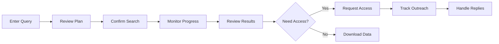
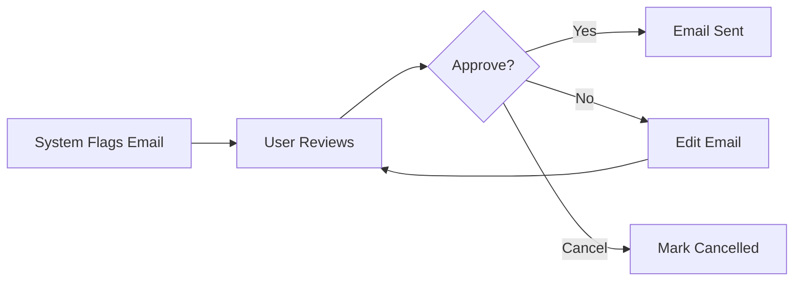
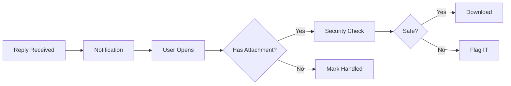

# Phase 4: Frontend API Specification & UX Requirements

## Overview
Define comprehensive API contracts and UX requirements for the frontend application that serves as the researcher's control cockpit for managing the biodata discovery and outreach workflow.

## Goals
- Define RESTful API endpoints with clear request/response schemas
- Specify WebSocket connections for real-time updates
- Document UI/UX requirements and user flows
- Design dataset card specifications and action workflows
- Establish error handling and user feedback patterns

## API Endpoints Specification

### 1. Authentication & User Context
```typescript
// POST /api/v1/auth/login
interface LoginRequest {
  email: string;
  password?: string;  // Optional for SSO
  sso_token?: string;
}

interface LoginResponse {
  access_token: string;
  refresh_token: string;
  user: {
    id: string;
    email: string;
    name: string;
    company: string;
    role: string;
  };
}

// GET /api/v1/auth/me
interface UserResponse {
  id: string;
  email: string;
  name: string;
  company: string;
  department: string;
  preferences: {
    default_modalities: string[];
    notification_settings: object;
  };
}
```

### 2. Research Query & Search
```typescript
// POST /api/v1/search
interface SearchRequest {
  query: string;  // "P53 mutations in lung adenocarcinoma"
  modalities?: string[];  // ["transcriptomics", "proteomics"]
  cancer_types?: string[];  // ["lung adenocarcinoma", "NSCLC"]
  sources?: ("GEO" | "PRIDE" | "ENSEMBL" | "INTERNAL")[];
  include_internal: boolean;
  max_results?: number;  // Default: 20
}

interface SearchResponse {
  task_id: string;
  status: "pending" | "running" | "completed" | "failed";
  estimated_duration_seconds: number;
  message: string;
}

// GET /api/v1/search/{task_id}
interface TaskStatusResponse {
  task_id: string;
  status: "pending" | "running" | "completed" | "failed";
  progress: number;  // 0-100
  current_step: string;
  steps_completed: string[];
  error_message?: string;
  result?: SearchResultData;
}

// GET /api/v1/search/{task_id}/results
interface SearchResultData {
  query: string;
  execution_time_seconds: number;
  datasets: DatasetInfo[];
  contacts: ContactInfo[];
  summary: {
    total_datasets: number;
    public_datasets: number;
    restricted_datasets: number;
    outreach_required: number;
    confidence_score: number;
  };
}
```

### 3. Dataset Management
```typescript
// GET /api/v1/datasets
interface DatasetsListResponse {
  datasets: DatasetInfo[];
  pagination: {
    page: number;
    per_page: number;
    total: number;
    total_pages: number;
  };
}

interface DatasetInfo {
  id: string;
  source: "GEO" | "PRIDE" | "ENSEMBL" | "INTERNAL";
  accession: string;
  title: string;
  description: string;
  modalities: string[];
  cancer_types: string[];
  organism: string;
  sample_size: number;
  access_type: "public" | "request" | "restricted";
  download_url?: string;
  publication_url?: string;
  contact_info?: {
    name: string;
    email: string;
    institution?: string;
  };
  relevance_score: number;
  outreach_status?: "not_initiated" | "pending_approval" | "sent" | "delivered" | "replied";
  created_at: string;
}

// GET /api/v1/datasets/{id}
// Returns: DatasetInfo

// POST /api/v1/datasets/{id}/request-access
interface RequestAccessRequest {
  urgency: "low" | "normal" | "high";
  additional_message?: string;
  cc_emails?: string[];
}

interface RequestAccessResponse {
  outreach_id: string;
  status: "queued" | "pending_approval" | "sent";
  requires_approval: boolean;
  approval_reason?: string;
}
```

### 4. Outreach Management
```typescript
// GET /api/v1/outreach
interface OutreachListResponse {
  outreach_requests: OutreachInfo[];
  stats: {
    total: number;
    pending: number;
    sent: number;
    replied: number;
    approved_required: number;
  };
}

interface OutreachInfo {
  id: string;
  dataset_id: string;
  dataset_title: string;
  contact_name: string;
  contact_email: string;
  status: "draft" | "queued" | "pending_approval" | "sent" | "delivered" | "replied" | "closed";
  requires_approval: boolean;
  approval_reason?: string;
  sent_at?: string;
  replied_at?: string;
  reply_preview?: string;
  has_attachments?: boolean;
}

// POST /api/v1/outreach/{id}/approve
interface ApproveOutreachResponse {
  success: boolean;
  message_id?: string;
  error?: string;
}

// POST /api/v1/outreach/{id}/cancel
interface CancelOutreachResponse {
  success: boolean;
}

// GET /api/v1/outreach/{id}/thread
interface EmailThreadResponse {
  messages: EmailMessage[];
  attachments: AttachmentInfo[];
}
```

### 5. Contacts & Colleagues
```typescript
// GET /api/v1/contacts
interface ContactsListResponse {
  contacts: ContactInfo[];
  sources: ("linkedin" | "internal_db" | "dataset_owner")[];
}

interface ContactInfo {
  id: string;
  name: string;
  email?: string;
  email_suggestions?: string[];
  job_title: string;
  department?: string;
  company: string;
  linkedin_url?: string;
  relevance_score: number;
  keywords_matched: string[];
  datasets_owned?: string[];  // Dataset IDs
}

// POST /api/v1/contacts/search
interface ContactSearchRequest {
  company?: string;
  departments?: string[];
  keywords?: string[];
  max_results?: number;
}
```

### 6. Export & Reports
```typescript
// POST /api/v1/export/datasets
interface ExportRequest {
  format: "csv" | "excel" | "json";
  dataset_ids?: string[];  // Empty = all
  include_metadata: boolean;
}

interface ExportResponse {
  download_url: string;
  expires_at: string;
  file_size_bytes: number;
}

// GET /api/v1/reports/summary/{task_id}
interface SummaryReportResponse {
  research_question: string;
  execution_date: string;
  datasets_overview: {
    total_found: number;
    by_source: Record<string, number>;
    by_modality: Record<string, number>;
    by_access_type: Record<string, number>;
  };
  outreach_summary: {
    total_sent: number;
    pending_approval: number;
    replies_received: number;
    success_rate: number;
  };
  recommendations: string[];
  next_steps: string[];
}
```

## WebSocket Specifications

### Real-time Updates Connection
```typescript
// WS /api/v1/ws
interface WebSocketMessage {
  type: "task_progress" | "outreach_update" | "new_reply" | "system_notification";
  timestamp: string;
  data: any;
}

// Task Progress Updates
interface TaskProgressMessage {
  type: "task_progress";
  data: {
    task_id: string;
    status: string;
    progress: number;
    current_step: string;
    message?: string;
  };
}

// Outreach Status Updates
interface OutreachUpdateMessage {
  type: "outreach_update";
  data: {
    outreach_id: string;
    dataset_id: string;
    new_status: string;
    details?: string;
  };
}

// New Reply Notification
interface NewReplyMessage {
  type: "new_reply";
  data: {
    outreach_id: string;
    from: string;
    subject: string;
    preview: string;
    has_attachments: boolean;
    requires_action: boolean;
  };
}
```

## UI/UX Requirements

### 1. Main Dashboard
**Purpose**: Research command center with overview of all activities

**Components**:
- **Search Bar** (prominent, top center)
  - Natural language input
  - Query suggestions based on history
  - Quick filters (modalities, cancer types)
  
- **Activity Feed** (left panel)
  - Real-time updates on searches, outreach, replies
  - Color-coded by status
  - Quick actions inline
  
- **Stats Overview** (top cards)
  - Active searches
  - Pending approvals
  - Unread replies
  - Datasets discovered today
  
- **Quick Actions** (right panel)
  - New search
  - View all datasets
  - Pending approvals
  - Export results

### 2. Search Interface
**Purpose**: Initiate and monitor dataset searches

**User Flow**:
1. Enter research query in natural language
2. Optional: Select specific databases and filters
3. Review generated search plan
4. Confirm and start search
5. Monitor progress with live updates
6. Review results as they arrive

**Visual Requirements**:
- Progress indicator with steps
- Live streaming of discovered datasets
- Ability to stop/pause search
- Save search for later

### 3. Dataset Cards
**Purpose**: Display dataset information with actionable options

**Card Layout**:
```
┌─────────────────────────────────────┐
│ [GEO] GSE123456        ★ 95% match │
│                                     │
│ Title: Lung adenocarcinoma P53...  │
│ Modality: RNA-seq, scRNA-seq       │
│ Samples: 247                       │
│ Access: Request Required           │
│                                     │
│ Contact: Dr. Smith (confirmed)     │
│                                     │
│ [Request Access] [Save] [Details]  │
└─────────────────────────────────────┘
```

**Interactive Elements**:
- Relevance score visualization
- Expandable description
- Quick preview of key metadata
- One-click outreach initiation
- Status badge (if outreach sent)

### 4. Outreach Management
**Purpose**: Track and manage all email communications

**Table View**:
| Dataset | Contact | Status | Sent | Action |
|---------|---------|--------|------|--------|
| GSE123456 | Dr. Smith | Delivered ✓ | 2h ago | View Thread |
| GSE789012 | Prof. Lee | Pending Approval ⚠️ | - | Approve |
| GSE345678 | Dr. Chen | Replied 📧 | Yesterday | Open Reply |

**Features**:
- Batch operations (approve multiple)
- Email preview on hover
- Thread view in modal
- Attachment indicators
- Follow-up scheduling

### 5. Approval Queue
**Purpose**: Human-in-the-loop safety checkpoint

**Approval Card**:
```
┌─────────────────────────────────────┐
│ ⚠️ Approval Required                │
│                                     │
│ Reason: Dataset may contain PHI    │
│                                     │
│ To: Dr. Director, Hospital         │
│ Dataset: Clinical trial data       │
│                                     │
│ [Preview Email]                    │
│                                     │
│ [Approve] [Edit] [Cancel]          │
└─────────────────────────────────────┘
```

### 6. Export & Reporting
**Purpose**: Generate shareable reports and data exports

**Export Options**:
- Dataset list (CSV/Excel)
- Full report (PDF)
- Integration export (for omics-os)
- API format (JSON)

## User Interaction Flows

### Flow 1: New Research Query


### Flow 2: Outreach Approval


### Flow 3: Reply Handling


## Error Handling & Feedback

### Error States
```typescript
interface ErrorResponse {
  error: {
    code: string;
    message: string;
    details?: any;
    suggestion?: string;
  };
  request_id: string;
}

// Common error codes
enum ErrorCode {
  RATE_LIMITED = "rate_limited",
  INVALID_QUERY = "invalid_query",
  NO_RESULTS = "no_results",
  APPROVAL_REQUIRED = "approval_required",
  AUTHENTICATION_FAILED = "auth_failed",
  PERMISSION_DENIED = "permission_denied",
  SERVICE_UNAVAILABLE = "service_unavailable"
}
```

### User Feedback Patterns
- **Success**: Green toast notification (3s auto-dismiss)
- **Warning**: Yellow banner (manual dismiss)
- **Error**: Red modal (requires acknowledgment)
- **Info**: Blue inline message
- **Progress**: Loading spinner with status text

## Accessibility Requirements

### WCAG 2.1 AA Compliance
- All interactive elements keyboard accessible
- ARIA labels for screen readers
- Color contrast ratio ≥ 4.5:1
- Focus indicators visible
- Error messages associated with form fields

### Responsive Design
- Desktop: Full feature set (1920x1080 optimal)
- Tablet: Simplified navigation, card stack
- Mobile: Read-only view with critical actions

## Performance Requirements

### API Response Times
- Search initiation: < 500ms
- Status polling: < 200ms
- Dataset list: < 1s for 100 items
- Export generation: < 5s for 1000 items

### Frontend Metrics
- Initial load: < 3s
- Time to interactive: < 5s
- Smooth scrolling (60 fps)
- Real-time updates without flicker

## Security Considerations

### Frontend Security
- XSS protection (sanitize all user input)
- CSRF tokens for state-changing operations
- Secure WebSocket connections (WSS)
- No sensitive data in localStorage
- API key never exposed to client

### Data Privacy
- PHI indicators clearly marked
- Audit log for all data access
- Export watermarking with user info
- Session timeout after 30min inactive

## Integration Points

### External Systems
```typescript
// Integration with omics-os
interface OmicsOSExport {
  version: "1.0";
  datasets: {
    id: string;
    source: string;
    accession: string;
    metadata: object;
  }[];
  workflow: {
    steps: string[];
    parameters: object;
  };
}
```

## Mock Data for Development

### Sample Search Response
```json
{
  "task_id": "task_123",
  "status": "completed",
  "datasets": [
    {
      "id": "ds_001",
      "source": "GEO",
      "accession": "GSE123456",
      "title": "P53 mutations in lung adenocarcinoma progression",
      "modalities": ["RNA-seq", "scRNA-seq"],
      "cancer_types": ["lung adenocarcinoma", "NSCLC"],
      "sample_size": 247,
      "access_type": "public",
      "relevance_score": 0.95
    }
  ]
}
```

### Sample WebSocket Message
```json
{
  "type": "task_progress",
  "timestamp": "2024-01-13T10:30:00Z",
  "data": {
    "task_id": "task_123",
    "status": "running",
    "progress": 45,
    "current_step": "Searching NCBI GEO database",
    "message": "Found 12 potential datasets, evaluating relevance..."
  }
}
```

## Implementation Notes

### For Frontend Developer
1. **State Management**: Use centralized store for datasets, outreach, and user context
2. **Polling Strategy**: 
   - Active tasks: Poll every 2s
   - Background tasks: Poll every 10s
   - Stop polling on completion/error
3. **Caching**: Cache dataset details for 5 minutes
4. **Optimistic Updates**: Update UI immediately, rollback on error
5. **Error Boundaries**: Wrap major sections to prevent full app crash

### API Client Setup
```typescript
// Suggested Axios interceptor setup
const apiClient = axios.create({
  baseURL: process.env.REACT_APP_API_URL,
  timeout: 30000,
  headers: {
    'Content-Type': 'application/json',
  }
});

apiClient.interceptors.request.use(config => {
  const token = localStorage.getItem('access_token');
  if (token) {
    config.headers.Authorization = `Bearer ${token}`;
  }
  return config;
});

apiClient.interceptors.response.use(
  response => response,
  async error => {
    if (error.response?.status === 401) {
      // Handle token refresh
    }
    return Promise.reject(error);
  }
);
```

## Next Phase
Phase 5 will implement the complete end-to-end workflow orchestration, comprehensive testing strategy, and deployment preparation.
